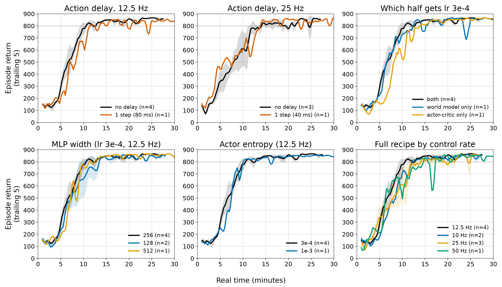

# Training as fast as possible on one real robot: a short survey

2026-10-06. Goal: one physical robot (one env), and the clock that matters is
real-world time. What the literature does, how DayDreamer drove its robots,
and what it suggests for us beyond `docs/SIM_PHONE.md`.

## 1. What the fast real-robot results have in common

| work | robot, result | algorithm | rate / action | what made it fast |
|---|---|---|---|---|
| DayDreamer (Wu et al., CoRL 2022) | A1 quadruped: roll over, stand, walk in **1 h** | DreamerV2 | 20 Hz joint-angle targets, PD on hardware | world model + imagination; learner thread trains non-stop beside the actor |
| A Walk in the Park (Smith, Kostrikov, Levine 2022) | A1 walks in **20 min** | DroQ (SAC + dropout + LayerNorm), high UTD | 20 Hz PD position targets in a narrow box around a nominal pose | high update-to-data ratio made stable by regularisation; MDP design ("constraining the action space is crucial") |
| Data Efficient RL for Legged Robots (Yang et al., CoRL 2019) | Minitaur walks on **4.5 min** of data | model-based MPC | 6 ms control, trajectory generators | multi-step model loss; planning that compensates for its own latency; structured action space |
| SERL (Luo et al. 2024) | manipulation in **15-60 min** | SAC/RLPD | - | actor/learner split, demos, careful system engineering |
| Learning to Walk in Minutes (Rudin et al., CoRL 2021) | ANYmal, **minutes** of sim training | PPO, thousands of parallel sims | - | not real-world sample efficiency: massive simulation, then sim-to-real. This is the colleague's route |

The recurring ingredients:

- **Actor and learner decoupled; the learner never waits.** DayDreamer drops
  the train-ratio knob entirely ("the decoupled learner optimizes ... without
  rate limiting"). We converged on the same thing: a saturated learner was the
  single biggest factor.
- **Many updates per real sample, made stable.** REDQ/DroQ (UTD ~20 with
  dropout + LayerNorm), BRO (bigger nets + regularisation + optimism), CrossQ
  (batch norm, no target nets), and BBF (Atari 100k: bigger nets, periodic
  resets, n-step and discount annealing) all show that more gradient steps
  per sample pays only if plasticity loss and overestimation are controlled.
  Our 12.5 Hz finding fits this: the extra updates per sample helped only with
  a higher lr and wider MLPs.
- **Model-based methods use samples best, and bigger models help.** DreamerV3
  reports that larger models and more gradient steps both raise data
  efficiency. TD-MPC2 is more data-efficient than DreamerV3 on DMC
  continuous control, especially on high-dimensional tasks, and more stable.
  It is the obvious alternative algorithm if Dreamer plateaus.
- **MDP design matters as much as the algorithm.** Bounded action spaces around
  a safe nominal pose, low-pass-filtered commands (DayDreamer uses a
  Butterworth filter on the A1), simple rewards, and a modest control rate
  (20 Hz in both quadruped papers).
- **Control rate is a trade-off.** Higher rates give a larger policy class.
  Lower rates make each action's effect detectable and shorten credit
  assignment (Metelli et al. 2020, action persistence). This is what our
  rate sweep showed, task-dependently: 12.5 Hz is fine for cartpole and fails
  reacher.
- **Latency must be modelled.** Yang et al. plan from a predicted future state.
  The general fix is to augment the state with the last actions. Our phone
  already reports the action it actually executed (`executed/drive`).

## 2. How DayDreamer drove its robots

| robot | action | low-level control | rate |
|---|---|---|---|
| A1 quadruped | continuous, 12 target motor angles | **PD controller on the hardware**, commands low-pass filtered (Butterworth) | **20 Hz** |
| UR5 arm | discrete end-effector increments | the robot's own controller | 2 Hz |
| XArm | discrete end-effector increments | the robot's own controller | ~0.5 Hz |
| Sphero Ollie | continuous torque, 2 motors | direct | 2 Hz |

Hyperparameters (appendix D): batch 32 × length 32, lr 1e-4, imagination 15,
**discount 0.95** (a ~20-step = **1 s** return horizon at 20 Hz), MLP 4×512
with LayerNorm, no train ratio (learner unthrottled).

So DayDreamer never made the RL policy the fastest loop. On the A1 the policy
picks joint targets at 20 Hz, and a PD loop on the motor drivers does the
stabilisation at kHz rates. Walk in the Park does the same:
τ = Kp(q* − q) − Kd q̇, targets at 20 Hz. Their short discount matches what our
sweep found independently: a ~1-2 s return horizon, not 333 steps.

Our robot differs here: the Dreamer action is a wheel PWM level applied
directly. There is no PD loop under it, so the policy *is* the balance loop,
at 10.8 Hz, through ~15 ms of latency, on an unstable plant with τ ≈ 50 ms. The
colleague's 200 Hz PID is a fast inner loop; DayDreamer's PD is one too.

## 3. What this suggests for us, ranked by expected gain

1. **Give the robot a fast inner loop and let Dreamer set its targets**, as
   DayDreamer and Walk in the Park do. A PID on the phone (or better, in the
   RP2040 firmware once the latency patch is in) balances. Dreamer outputs a
   setpoint (target tilt, or wheel velocity) or a residual on the PID output at
   10-25 Hz. This removes the 10.8 Hz ceiling from the stability problem and
   makes early exploration safe. It is the biggest change and the biggest
   likely win. A sim analogue needs a balance task with a PD under the action
   (cartpole balance with a velocity-target action, a small wrapper).
2. **Don't start from scratch.** The colleague has a simulator of the robot.
   Pretrain the world model and policy there, then fine-tune on the robot. Or,
   at minimum, warm-start from previous robot replay. Offline-to-online is the
   cheapest real-time saving there is. Watch the observation scaling: the
   2026-09-03 replay predates commits 374ba38/8031027.
3. **A faster learner GPU.** We are learner-bound, so an A100 (when the b64
   array frees it) should cut minutes directly. Untested.
4. **Plasticity tricks for long sessions** (BBF/SR-SPR resets, shrink-and-
   perturb, "Mind the Model" world-model resets). They are unlikely to matter
   in the first 10 minutes, but robot sessions run for hours.
5. **Discount / horizon annealing** (BBF): start short, grow longer. We found
   ~2 s best early; a schedule could keep that and recover long-horizon
   behaviour later. Needs a small code change.
6. **TD-MPC2** as an algorithmic alternative if Dreamer plateaus on the robot.
   Its planning at act time is heavier on the phone.

Round 14 (e1215-e1222), minutes to hold 800 against the recipe's 10.6
(range 8.9-12.8): 1-step action delay 11.4 (12.5 Hz, 80 ms) and 13.9 (25 Hz);
MLP 512 11.4; lr 3e-4 on the world model only 12.4, on the actor-critic only
13.9; actor entropy ×3 10.1; recipe at 50 Hz 14.7. **The recipe tolerates a
full step of delay, and nothing beats it beyond seed noise.** Hyperparameter
search has plateaued; items 1-3 above are where further speed has to come
from.

## Sources

- DayDreamer: [arXiv 2206.14176](https://arxiv.org/abs/2206.14176), [project page](https://danijar.com/project/daydreamer)
- A Walk in the Park: [arXiv 2208.07860](https://arxiv.org/abs/2208.07860)
- Data Efficient RL for Legged Robots: [arXiv 1907.03613](https://arxiv.org/abs/1907.03613)
- Learning to Walk in Minutes (massively parallel): [PMLR v164](https://proceedings.mlr.press/v164/rudin22a.html)
- SERL: [arXiv 2401.16013](https://arxiv.org/html/2401.16013v4)
- DreamerV3: [arXiv 2301.04104](https://arxiv.org/abs/2301.04104), [project page](https://danijar.com/project/dreamerv3/)
- TD-MPC2: [arXiv 2310.16828](https://arxiv.org/pdf/2310.16828)
- BBF: [ICML 2023](https://proceedings.mlr.press/v202/schwarzer23a.html)
- BRO: [arXiv 2405.16158](https://arxiv.org/pdf/2405.16158); CrossQ: [ICLR 2024](https://proceedings.iclr.cc/paper_files/paper/2024/hash/f381114cf5aba4e45552869863deaaa7-Abstract-Conference.html); Scaling off-policy RL (CrossQ+WN): [arXiv 2502.07523](https://arxiv.org/html/2502.07523v2)
- Plasticity: [PLASTIC](https://arxiv.org/pdf/2306.10711); primacy bias in MBRL, [Mind the Model](https://arxiv.org/pdf/2310.15017); [high replay ratio + resets (MARR)](https://arxiv.org/pdf/2404.09715)
- Control frequency / action persistence: [Metelli et al. 2020](https://arxiv.org/pdf/2002.06836)
- Delays: [Delays in RL (survey)](https://arxiv.org/pdf/2309.11096)
- Asynchronous model-based RL: [arXiv 1910.12453](https://arxiv.org/pdf/1910.12453)
