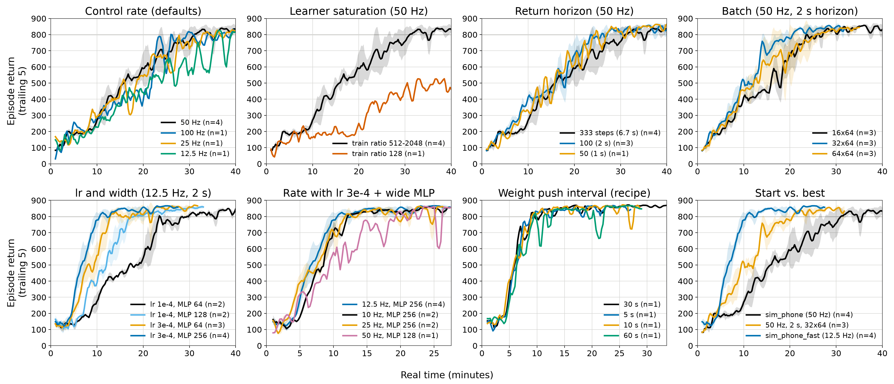
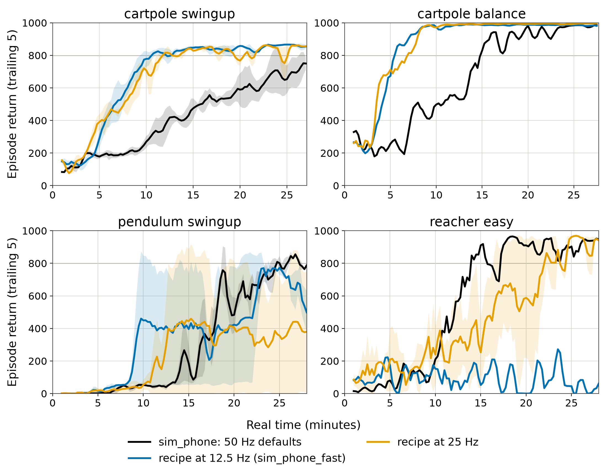

# The phone robot in simulation: real-time cartpole

## Summary (2026-10-06, 84 runs, e1113-e1196)

Metric: minutes of **real time** until the trailing-5-episode mean holds ≥ 800
on cartpole swingup, one env paced to wall clock, phone-style actor/learner
split, 1× P100 learner.

| config | control | key changes | min to 800 |
|---|---|---|---|
| `sim_phone` (start) | 50 Hz | defaults (horizon 333, lr 1e-4, 16×64) | 25.5 (4 seeds) |
| 50 Hz recipe | 50 Hz | horizon 100 (2 s), batch 32×64 | 16.6 (3 seeds) |
| **`sim_phone_fast`** | **12.5 Hz** | horizon 25 (2 s), 32×64, **lr 3e-4, MLP 256** | **10.6 (4 seeds)** |
| same at 25 Hz | 25 Hz | horizon 50 | 9.9-14.1 (4 seeds) |
| same at 10 Hz | 10 Hz | horizon 20 | 12.1 (2 seeds) |





Trailing-5 return against real time, mean ±1 std over seeds (n in the
legend). Each mean ends where its shortest seed ends. Regenerate with
`tools/plot_sim_sweep.py --out docs/figs` (needs matplotlib, which
`dreamerv3_env` lacks a working copy of).

What mattered, in order:
1. **Keep the learner saturated.** It is the bottleneck. A half-idle learner
   (train_ratio 128) took 3x as long.
2. **A return horizon of ~2 s, not 333 steps.** It helped at every rate.
3. **At low control rates, a faster lr and wider MLPs.** The learner then
   does 4x more updates per real sample, and only lr 3e-4 plus 256-wide MLPs
   turn that into progress. At 50 Hz the same change does nothing.
4. **Batch 32×64.** It is free on a P100: the learner is host-bound up to
   32 and GPU-bound from 64.

What did not matter: weight-push interval 5-60 s, imagination length,
RSSM size, horizon 50-150 at 50 Hz.

Caveats. **The control rate is task-dependent.** 12.5 Hz breaks reacher_easy,
which never learns, while 25-50 Hz with the same knobs hold 800 at ~14-15 min.
It is fine for cartpole swingup/balance and pendulum. Pendulum's sparse reward
makes single seeds meaningless: the same arm went from failing to fastest
between seeds. The recipe ran stably for 2.6 h (e1177, 800-874 throughout).
All results are single P100s. A different learner GPU moves the
batch/throughput trade-off.

For the robot: config block `robot_fast` (on top of `robot_daydreamer`)
carries these changes, scaled to 10.8 Hz (horizon 22). It is untested on
hardware. After the firmware fix, prefer ~25 Hz with horizon 2 s × Hz.


Started 2026-10-05. A stand-in for the robot that needs neither the phone nor
the base, for tuning how fast DreamerV3 learns **per minute of real time**.

## What it is

Config block `sim_phone` (`dreamerv3/configs.yaml`), launcher
`sbatch/run_sim_phone.sbatch`, analysis `tools/sim_curve.py`.

- One `dmc_cartpole_swingup`, proprio only, no rendering (`env.dmc.render: False`).
- `env.realtime_hz` wraps it in `embodied.wrappers.RealTime`, which paces every
  step against absolute wall-clock deadlines. It cannot run faster than real
  time, so samples are as scarce as on the robot. `log/rt_lag_ms` records how
  late each step started; that is the check that real time was held.
- The robot's `online_learning` split. The actor process plays the phone: its
  policy is on CPU, it never waits for the learner, and it picks up new weights
  every `online_sync_every` seconds (the robot's `env.robot.weights_every`).
  The learner trains on the GPU from the replay the actor streams to it.
- Control rate = 100 Hz physics / `env.dmc.repeat`. Keep `env.realtime_hz`
  equal to it. An episode is always 10 s of real time.

```bash
sbatch -J e<N>_cartpole_rt50 sbatch/run_sim_phone.sbatch                  # 50 Hz
sbatch -J e<N>_cartpole_rt12 sbatch/run_sim_phone.sbatch \
  --env.dmc.repeat 8 --env.realtime_hz 12.5                                # robot today
python tools/sim_curve.py /work/DoyaU/vasilache/work/e<N>_*                # minutes to hold 500/700/800
```

Since every step is paced, `minutes = actor step / hz / 60`. Learner start-up
(JIT, prefill of one batch) happens before the actor's first step and is not
on that clock. It is a constant of roughly a minute.

## What the phone setup changes about the knobs

With wall-clock time as the budget, two quantities are fixed by the hardware.
One is the **sample rate** (control Hz). The other is the **learner's update
rate** `u` (train steps/s, set by GPU and model size). Everything follows from
them:

- Effective replay ratio = `u * batch * length / Hz`. Once the learner is
  saturated, `run.train_ratio` above that value changes nothing. It only stops
  mattering when it sits *below* what the GPU can do, in which case the GPU
  idles.
- The control rate sets how far ahead the model looks, in seconds. The defaults
  are `imag_length 16` and `horizon 333` (discount 0.997). At 50 Hz that is a
  0.3 s imagination window and a 6.7 s return horizon. At 12.5 Hz it is 1.3 s
  and 27 s. Lower rates give longer credit assignment per step and more updates
  per sample. Higher rates give finer control. PlaNet ran cartpole at action
  repeat 8 (12.5 Hz) for exactly this reason. For a robot whose tilt grows with
  τ ≈ 50 ms, the floor on the control rate is set by stability, not by learning.
- `online_sync_every` is how stale the acting policy is. While learning is
  fast, every second of staleness is collected on an older policy.

## Round 1 (job log `job_logs/sim_phone_r1.tsv`)

All arms run on upgraded P100s with size1m, batch 16×64 and a 2 h wall limit.
The defaults are 50 Hz, train_ratio 512 and sync 30 s.

| exp | change | question |
|---|---|---|
| e1113 | baseline | reference curve, learner speed `u` on P100 |
| e1114 | sync 5 s | does weight staleness cost wall-clock time? |
| e1115 | 25 Hz | control rate |
| e1116 | 12.5 Hz | control rate (≈ robot today) |
| e1117 | 100 Hz | control rate (≈ robot with the firmware fix) |
| e1118 | train_ratio 2048 | is the learner saturated at 512? |
| e1119 | train_ratio 128 | is less replay better early? |
| e1120 | 12.5 Hz + sync 5 s | the two expected winners together |

Results: see the end of this file once in.

### Early read, 15 min in (2026-10-05 15:15)

- **Real time holds.** Every arm logs one episode per ~10 s. One step per
  episode starts ~260 ms late, almost certainly the actor's once-per-episode
  log write holding the GIL, so the sim clock runs ~2.6% slow. The step
  counter therefore slightly under-reports real time. The phone has no such
  stall.
- **The learner is saturated in every arm except train_ratio 128.** After
  15 min, e1113 (50 Hz), e1115 (25 Hz), e1116 (12.5 Hz) and e1118
  (train_ratio 2048) had each trained on ~28.5M samples, i.e. ~32k samples/s
  on a P100 for size1m 16×64. So `run.train_ratio` 512 and 2048 are the same
  experiment, and the *effective* replay ratio is fixed by the control rate:
  samples trained per agent step ≈ 270 (100 Hz), 650 (50 Hz), 1290 (25 Hz),
  2580 (12.5 Hz). e1119 (train_ratio 128) left the GPU half idle (11.4M).
  (Correction, 18:50: `fps/train` is the right throughput number, ~16k
  samples/s at 16×64. The learner's step counter advances ~2x faster than
  samples trained, so the per-agent-step ratios above are 2x too high.
  Relative comparisons hold.)
- **Seed noise is large.** e1113 and e1118 are effectively the same config,
  and at 15 min they score 415 and 530 (last-5). No ordering in round 1 is
  real until it is replicated.

### Round 1 result (2026-10-05 15:45, ~46 min of real time)

Minutes of real time until the trailing-5 mean first holds each score. Single
seed. e1113 and e1118 are the same effective config: two seeds of the
saturated 50 Hz base.

| exp | arm | >500 | >700 | >800 | last-5 at ~46 min |
|---|---|---|---|---|---|
| e1118 | 50 Hz (tr 2048) | 12.4 | 19.9 | **20.5** | 855 |
| e1113 | 50 Hz base | 15.4 | 23.0 | **23.4** | 857 |
| e1117 | 100 Hz | 22.0 | 22.7 | 26.0 | 839 |
| e1114 | 50 Hz, sync 5 s | 17.4 | 24.7 | 29.7 | 862 |
| e1115 | 25 Hz | 15.6 | 27.3 | 33.0 | 776 |
| e1116 | 12.5 Hz | 21.3 | 31.6 | 36.0 | 848 |
| e1120 | 12.5 Hz, sync 5 s | 20.3 | 35.4 | - | 797 |
| e1119 | 50 Hz, tr 128 | 30.4 | - | - | 514 |

- **The control-rate hypothesis was wrong.** 50 Hz is fastest (20-23 min to
  800). Lower rates are slower, not faster, despite 2-4x more training per
  sample. At 12.5 Hz cartpole is controllable (it reaches 850) but takes
  about 1.6x as long. 100 Hz is close to 50 Hz. For a fixed GPU, the extra
  samples per second at higher rates outweigh the extra updates per sample at
  lower ones, down to 50 Hz.
- **Weight-sync staleness is not the bottleneck.** Sync 5 s was no faster than
  30 s, which is within seed noise. A 30 s weight push on the phone is fine.
- **Starving the learner costs the most.** train_ratio 128 left the GPU half
  idle and is still under 700 at 46 min. Learner throughput is the
  bottleneck, which is what round 2 targets.
- Six converged arms were cancelled at ~46 min to free GPUs and are archived
  in the bucket. e1119 and e1120 run to their 2 h limit.

### Round 2 result (e1121-e1126 to 75 min; e1127/e1128 ran later)

Minutes to hold trailing-5 ≥ 800. The base (50 Hz, horizon 333, lr 1e-4,
16×64) now has three seeds: **20.5, 23.4, 31.2** (mean 25). Seed spread is
±5 min, so only a large gap is a result.

| exp | change | >800 | samples trained (vs base) |
|---|---|---|---|
| e1126 | horizon 100 | **18.9** | same |
| e1122 | lr 3e-4 | 23.4 | same |
| e1125 | deter 256 | 26.4 | same |
| e1123 | batch 16×32 | 29.1 | **half** |
| e1124 | batch 8×64 | 37.4 | **half** |

- **The learner is bound by per-update overhead, not FLOPs.** Halving the
  batch did not raise updates/s: samples trained per second halved instead,
  and both small-batch arms were the slowest. A smaller model (deter 256) was
  also no faster per update. For size1m on a P100 the update count is fixed,
  so data per update is the free knob. Round 3 tests 32×64 and 64×64.
- Horizon 100 (γ 0.99, a 2 s return horizon at 50 Hz) is the only arm
  outside the base's seed spread. It is replicated in round 3.
- lr 3e-4 and deter 256 are within noise.

### Round 3 at ~30 min (2026-10-05 17:40)

| exp | change | >800 (min) |
|---|---|---|
| e1133 | horizon 100 + batch 32×64 | **14.0** |
| e1135 | horizon 100 + lr 3e-4 | **16.7** |
| e1126/29/30 | horizon 100, 3 seeds | 18.9 / 23.5 / 23.7 (mean 22.0) |
| e1132 | batch 64×64 | 24.0 |
| e1134 | horizon 50 | 24.4 |
| e1131 | batch 32×64 | 27.2 |
| base | 4 seeds | 20.5 / 23.4 / 26.7 / 31.2 (mean 25.5) |

Batch 32×64 really is free: 1300 trained samples per agent step against 650,
at the same update rate. 64×64 reaches 2030 (~1.5x the per-update cost). On
its own the extra data does not help, but together with horizon 100 it gives
the fastest run so far. Round 4 (e1137-e1145) replicates the two
combinations. It also tests whether control rate matters once the return
horizon is fixed at 2 s rather than 100 steps.

Round 3 final (75 min): unchanged from the 30-min read above. All arms end at
862-874. Archived.

### Why the update rate is fixed (2026-10-05 18:30)

`usage/nvsmi/compute_avg` (GPU kernel-busy fraction) in the learner rows:
**0.60 at batch 16×64, 0.87 at 32×64, 0.98 at 64×64**, while the learner
process sits at one full CPU core (`proc_cpu_usage` ≈ 1.0-1.15). `tools/bench_learner.py` (pure jitted train step, synthetic batches, same
P100) puts a number on it:

| batch | pure train step | real learner (`fps/train` / batch) |
|---|---|---|
| 16×64 | 24.9 updates/s | ~15.6 updates/s |
| 32×64 | 18.4 | ~15.6 |
| 64×64 | 11.9 | ~11.8 |
| 128×64 | 7.7 | - |

The real learner is capped at ~15.6 updates/s by host-side work, mostly
replay sampling, up to batch 32. From 64 the GPU is the limit. So 32×64
doubles the data per update for free, and 64×64 costs ~25% of the updates.
Removing the host overhead (prefetching more, fusing updates) would gain ~60%
updates at 16×64 but only ~18% at 32×64. It is not worth the refactor while
32×64 is the recipe.

### Round 4 (2026-10-05 19:00, ~35 min of real time)

| arm | seeds: minutes to hold 800 | mean |
|---|---|---|
| **horizon 100 + batch 32×64** | 14.0 / 16.4 / 19.4 | **16.6** |
| horizon 100 + lr 3e-4 | 16.7 / 15.4 / 19.4 | 17.2 |
| horizon 100 + 32×64 + lr 3e-4 | 14.4 / 20.7 | 17.6 |
| horizon 100 + 64×64 | 15.0 | - |
| horizon 100 | 18.9 / 23.5 / 23.7 | 22.0 |
| base (horizon 333, 16×64) | 20.5 / 23.4 / 26.7 / 31.2 | 25.5 |
| 100 Hz, horizon 200 (2 s), 32×64 | 25.0 | - |

**Current recipe: horizon 100 + batch 32×64, about 35% faster than the base.**
lr 3e-4 helps on its own but adds nothing on top of the larger batch. At a
fixed 2 s return horizon, 100 Hz is still slower than 50 Hz, so 50 Hz is not
best only because of the horizon in steps.

### Rounds 5-6: the rate at a fixed 2 s horizon, then tuning at 12.5 Hz

Minutes to hold 800, batch 32×64, horizon = 2 s:

| rate | default lr 1e-4 | best tweak |
|---|---|---|
| 100 Hz | 25.0 | - |
| 50 Hz | 16.6 (3 seeds) | lr 3e-4 / units 128 / imag 32: within noise |
| 25 Hz | 23.8 / 20.2 | (round 7) |
| 12.5 Hz | 23.7 / 23.0 | **lr 3e-4: 12.8**, units 128: 15.0 |

At 50 Hz, tuning plateaus around 15-17 min. 64×64 came in at 15.0 / 16.0 /
28.2, no better than 32×64. At 12.5 Hz the learner does ~4x more updates per
real sample, so a faster learning rate or a wider network pays off, and the
fastest single run so far is at the robot's rate. Round 7 replicates this.

### Round 7 (2026-10-05 21:25): the low-rate recipe

| arm (32×64, 2 s horizon) | >800 (min) |
|---|---|
| 12.5 Hz, lr 3e-4, units 256 | **8.9** |
| 12.5 Hz, lr 3e-4, units 128 | **9.1** |
| 25 Hz, lr 3e-4, units 128 | **9.9** |
| 12.5 Hz, lr 3e-4 (3 seeds) | 12.8 / 11.1 / 13.9 |
| 12.5 Hz, lr 1e-3 | 11.9, then unstable |
| 12.5 Hz, units 128 (2 seeds) | 15.0 / 21.3 |
| 50 Hz, lr 3e-4, units 128 | 19.4 |

The extra updates per real sample at a low control rate only pay off when the
model can absorb them, with a faster learning rate and a wider network. At
50 Hz the same change does not help, because there the learner is already
behind the data. Round 8 replicates the recipe and runs it at 10 Hz.

### Round 8-9: the recipe replicated, and the robot-facing checks

`sim_phone_fast` (12.5 Hz, 32×64, horizon 25, lr 3e-4, MLP units 256) holds
800 at **8.9 / 12.8 / 9.7 / 10.8 min (mean 10.6, 4 seeds)**, against 25.5 for
`sim_phone`. Close variants are all in the same band: units 128 (9.1 / 13.6),
25 Hz (9.9-14.1), lr 5e-4 (10.1), deter 1024 (10.8), batch 16×64 (11.3), and
**10 Hz (12.1 / 12.1)**.

Weight-push interval with the recipe: 5 s 9.4, 10 s 9.1, 30 s 8.9, 60 s 9.4.
**It does not matter.** The phone's 30 s push (`env.robot.weights_every`) is
fine, and a 5 MB push over a 2 MB/s link is no constraint.

e1177 runs the recipe for 3 h to check that lr 3e-4 stays stable. Round 10
(e1180-e1185) checks whether the recipe transfers to pendulum swingup,
cartpole balance and reacher easy.
